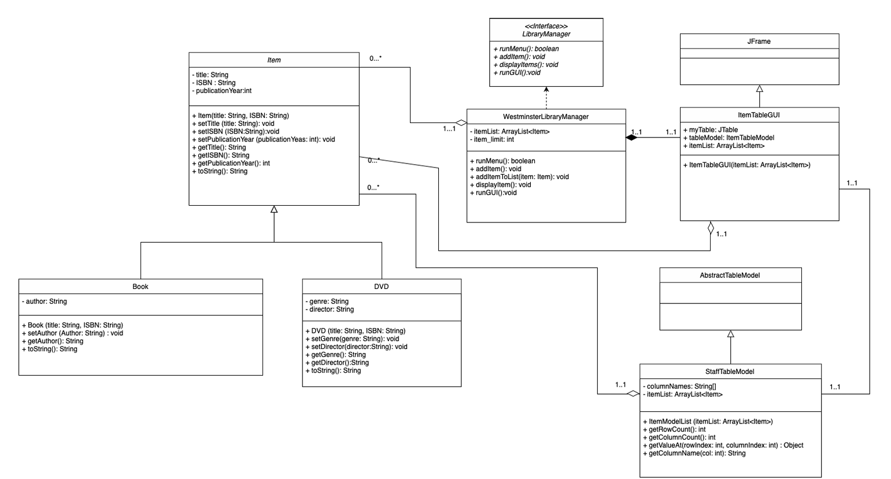

# Library Centre Management System

A robust, object-oriented desktop application built in Java to streamline the tracking, management, and viewing of library assets such as Books, DVDs, and Magazines. The application features an interactive graphical user interface (GUI) built with Java Swing and includes full unit testing coverage.

## 🛠️ Technologies Used

* **Language:** Java (JDK 17)
* **GUI Framework:** Java Swing & AWT
* **Build & Dependency Management:** Apache Maven
* **Unit Testing Framework:** JUnit Jupiter (JUnit 5)

---

## 📐 System Architecture & UML Diagram

The project is structured around solid Object-Oriented Programming (OOP) principles, utilizing inheritance for library item specialization and a dedicated Table Model for the graphical interface.



---

## 🚀 How to Run the Project

### Prerequisites
* Java Development Kit (JDK) 17 or higher
* Apache Maven installed (or an IDE that supports it like NetBeans, IntelliJ, or Eclipse)

### Running via Command Line
1. Clone the repository:
   ```bash
   git clone [https://github.com/YOUR_USERNAME/java-swing-library-manager.git](https://github.com/YOUR_USERNAME/java-swing-library-manager.git)
   cd java-swing-library-manager

# Build and Run the Project

## Building with Maven

Open your terminal and run:
```bash
mvn clean compile
```

## Executing the Application
Run:
```bash
mvn exec:java
```

## Running via an IDE (NetBeans/IntelliJ/Eclipse)
1. Open the project folder directly in your preferred IDE. It will automatically recognize it as a Maven project via the `pom.xml`.
2. Right-click the project root and select **Clean and Build**.
3. Locate `LibraryCentre.java` inside `src/main/java/librarycentre_package/`, right-click it, and select **Run File**.

## Running the Test Suite
To execute the automated JUnit unit tests, run:
```bash
mvn test
```

# Challenges Overcame
1. **Synchronizing Swing Components with Custom Data Collections**
   - Integrating a standard Java `ArrayList<Item>` directly into a `JTable` GUI display was highly problematic initially, as standard table models don't handle custom object lists seamlessly.
   - **Solution:** Built a bespoke `ItemTableModel` extending `AbstractTableModel`. This created a clean buffer wrapper that dynamically mapped object properties (like `getISBN()`, `getTitle()`) directly into zero-indexed table columns, ensuring the UI updates predictably whenever library data changes.
2. **Maven Lifecycle Misalignments during Refactoring**
   - During mid-development refactoring and package renaming, the compiler kept throwing `ClassNotFoundException` errors because the system configurations were looking for old main class paths.
   - **Solution:** Cleaned out the generated output caches completely (`target/` folder) and synced the configuration properties in the `pom.xml` under `<exec.mainClass>` to explicitly match the new `librarycentre_package.LibraryCentre` entry point.